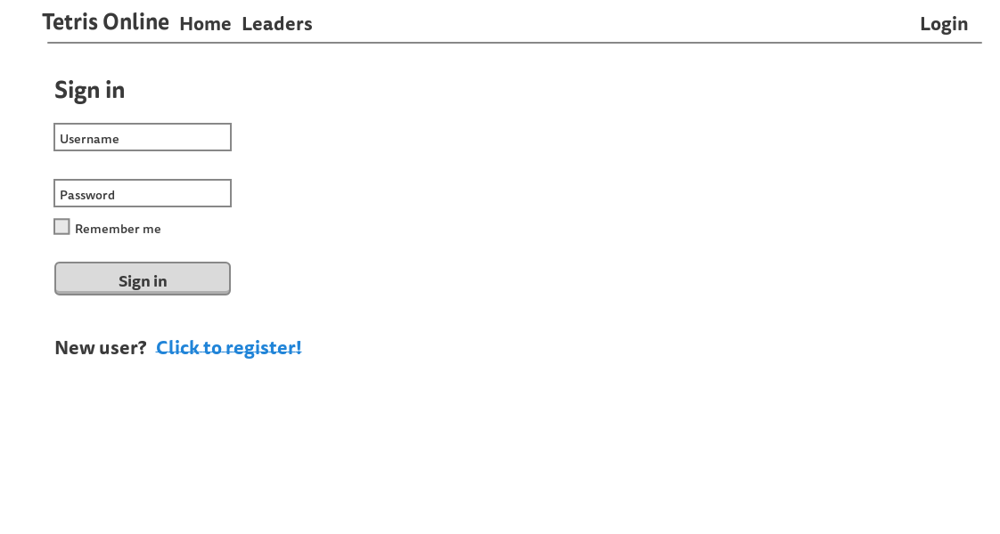
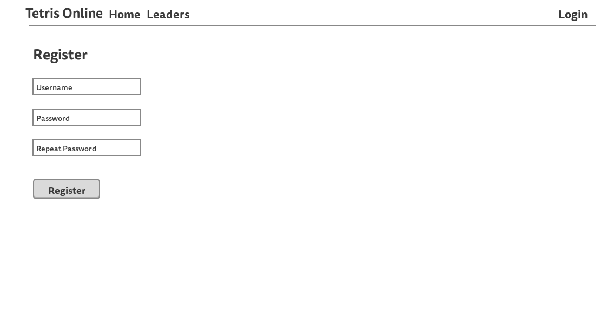
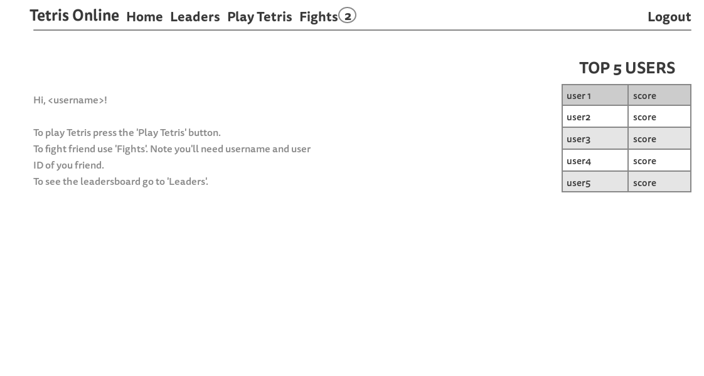
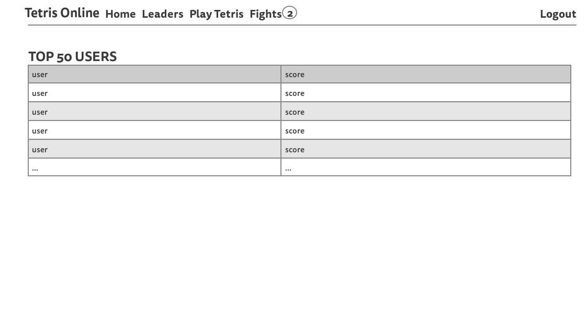
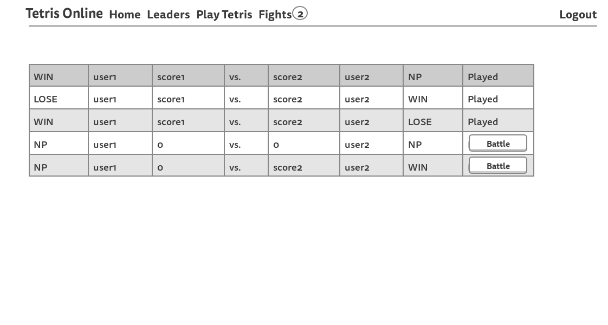

# Техническое задание "Tetris Online"

## Оглавление
* [Введение](#ВВЕДЕНИЕ)
  * [Назначение](#НАЗНАЧЕНИЕ)
  * [Масштаб проекта](#МАСШТАБ-ПРОЕКТА)
  * [Целевая аудитория](#МАСШТАБ-ПРОЕКТА)
* [Общее описание](#ОБЩЕЕ-ОПИСАНИЕ)
  * [Описание](#ОПИСАНИЕ)
  * [Общая Функциональность](#ОБЩАЯ-ФУНКЦИОНАЛЬНОСТЬ)
    * [С точки зрения разработчиков](#С-ТОЧКИ-ЗРЕНИЯ-РАЗРАБОТЧИКОВ)
    * [С точки зрения клиента](#С-ТОЧКИ-ЗРЕНИЯ-КЛИЕНТА)
  * [Функции продукта](#ФУНКЦИИ-ПРОДУКТА)
    * [Фронтенд (сайт)](#ФРОНТЕНД-(САЙТ))
    * [Бэкенд (сервер)](#БЭКЕНД-(СЕРВЕР))
  * [Характеристики пользователя](#ХАРАКТЕРИСТИКИ-ПОЛЬЗОВАТЕЛЯ)
  * [Ограничения](#ОГРАНИЧЕНИЯ)
* [Детальные требования](#ДЕТАЛЬНЫЕ-ТРЕБОВАНИЯ)
  * [Требования ко внешним интерфейсам](#ТРЕБОВАНИЯ-КО-ВНЕШНИМ-ИНТЕРФЕЙСАМ)
    * [Интерфейс пользователя](#ИНТЕРФЕЙС-ПОЛЬЗОВАТЕЛЯ-(САЙТ))
    * [Серверный интерфейс (API)](#СЕРВЕРНЫЙ-ИНТЕРФЕЙС-(API))
  * [Функциональные требования](#ФУНКЦИОНАЛЬНЫЕ-ТРЕБОВАНИЯ)
  * [Описание возможностей](#ОПИСАНИЕ-ВОЗМОЖНОСТЕЙ)
    * [Неавторизованный пользователь](#НЕАВТОРИЗОВАННЫЙ-ПОЛЬЗОВАТЕЛЬ)
    * [Авторизованный пользователь](#АВТОРИЗОВАННЫЙ-ПОЛЬЗОВАТЕЛЬ)
  * [Системные требования](#СИСТЕМНЫЕ-ТРЕБОВАНИЯ)
  * [Перспективы развития](#ПЕРСПЕКТИВЫ-РАЗВИТИЯ)
  * [Стек технологий](#СТЕК-ТЕХНОЛОГИЙ)
  
## ВВЕДЕНИЕ
### НАЗНАЧЕНИЕ
Создание соревновательного онлайн сервиса по игре в Tetris.
### МАСШТАБ ПРОЕКТА
Данный проект является независимой и самостоятельной разработкой.
### ЦЕЛЕВАЯ АУДИТОРИЯ
Целевая аудитория данного сервиса - Интернет пользователи.

## ОБЩЕЕ ОПИСАНИЕ
### ОПИСАНИЕ
Данное веб приложение представляет собой базу данных с веб интерфейсом - сайт с игрой в Tetris.
### ОБЩАЯ ФУНКЦИОНАЛЬНОСТЬ
#### С ТОЧКИ ЗРЕНИЯ РАЗРАБОТЧИКОВ
* Создать базу для хранения данных пользователей и истории вызовов;
* Создать веб интерфейс для работы с базой;
* Написать логику игры Tetris.
#### С ТОЧКИ ЗРЕНИЯ КЛИЕНТА
* Создать простой и удобный сайт для игры в Tetris;
* Предоставить возможность соревнований.
### ФУНКЦИИ ПРОДУКТА
#### ФРОНТЕНД (САЙТ)
* Регистрация под настоящим именем или вымышленным никнейном;
* Просмотр таблицы лидеров;
* Возможность игры в Tetris прямо в браузере с помощью клавиатуры;
* Возможность вызывать других пользователей;
* Игра в вызове.
#### БЭКЕНД (СЕРВЕР)
* Сохранение полной истории всех вызовов.
### ХАРАКТЕРИСТИКИ ПОЛЬЗОВАТЕЛЯ
Пользователь ПК с клавиатурой.
### ОГРАНИЧЕНИЯ
* Управление в игре Tetris реализовано только посредством клавиатуры;
* Интерфейс сайта реализован только на английском языке.

## ДЕТАЛЬНЫЕ ТРЕБОВАНИЯ
### ТРЕБОВАНИЯ КО ВНЕШНИМ ИНТЕРФЕЙСАМ
#### ИНТЕРФЕЙС ПОЛЬЗОВАТЕЛЯ (САЙТ)
Макет сайта доступен [здесь](https://gomockingbird.com/projects/hq1eqhv).  
Все страницы должны иметь вверху навигационное меню.
Интерфейс пользователя представляет собой сайт, который включает в себя следующие страницы:
1. **Страница входа**  
Содержит форму для входа и ссылку на страницу регистрации.  

2. **Страница регистрации**  
Содержит форму для регистрации.  

3. **Домашняя страница**  
Содержит подсказку по сайту и таблицу с 5 лучшими пользователями и их результатами.  

4. **Таблица лидеров**  
Содержит таблицу лучших 50 пользователей. Если текущий пользователь попал в эту таблицу, соответствующая строка должны быть подсвечена.  

5. **Игра в Tetris**  
Содержит подсказку по управлению, поле с игрой и таблицу с 5 лучшими пользователями и их результатами.  

6. **Вызовы**  
Содержит форму для отправки вызовов и таблицу с историей вызовов.
При нажатии на кнопку 'Battle' пользователь перемещается на страницу с игрой в Tetris, но её результат будет относиться к конкретному вызову. У пользователя только одна попытка.  
Также, количество новых вызовов отображается в круге рядом со вкладкой 'Fights'.

#### СЕРВЕРНЫЙ ИНТЕРФЕЙС (API)
1. Метод для внесения очков пользователя в базу данных по завершению игры. 
### ФУНКЦИОНАЛЬНЫЕ ТРЕБОВАНИЯ
* Регистрация пользователей;
* Вход пользователей;
* Отображение таблицы лидеров;
* Реализация игры Tetris;
* Вызовы;
* Отображение вызовов;
* Игра в вызове;
* Автоматическое определение победителя.
### ОПИСАНИЕ ВОЗМОЖНОСТЕЙ
#### НЕАВТОРИЗОВАННЫЙ ПОЛЬЗОВАТЕЛЬ
* Посещение домашней страницы;
* Просмотр таблицы лидеров;
* Вход;
* Регистрация.
#### АВТОРИЗОВАННЫЙ ПОЛЬЗОВАТЕЛЬ
* Посещение домашней страницы;
* Просмотр таблицы лидеров;
* Игра в Tetris;
* Просмотр своей страницы вызовов;
* Вызов других пользователей;
* Выход из своей учетной записи.
### СИСТЕМНЫЕ ТРЕБОВАНИЯ
* ОС: Windows, Linux, MacOS X
* CPU: 1.2Gz
* RAM: 1 Gb
* Storage: Минимум 1 Gb
### ПЕРСПЕКТИВЫ РАЗВИТИЯ
* Добавление турниров на основе вызовов;
* Добавление поиска соперников.
### СТЕК ТЕХНОЛОГИЙ
* Python Flask для реализации бэкенда
* HTML+CSS+JS для реализации фроненда
* База данных SQLite (модуль SQLAlchemy для работы в Python) для хранения данных
